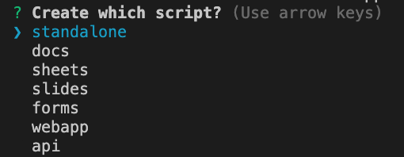

# Google Apps Script Development 💯

The Google Apps Script Starker kit supports the new **V8 JavaScript runtime** that powers Chrome and Node.js. You can write code using modern ECMAScript syntax like Arrow functions, Classes, Template Literals, Destructuring and more.


You can build GSuite add-ons (for Google Docs, Slides, Gmail and Google Sheets), web applications and workflow automation routines with next-generation JavaScript.

### :package: Getting Started

**1.** Clone the repository and install npm dependencies and [utilities](TOOLS.md).

```
git clone `this repo` my-project
cd my-project
npm install
```
Note: If you experience a `node-gyp` error you should be okay to proceed.

**2.** Log in to Google clasp and authorize using your Google account.

```
npx clasp login
```

**3.** Create a new Google Script bound to a Google Sheet (or set the type as standalone to create a standalone script in your Google Drive)

```
npx clasp create  
```

Choose `webapp` 

When you run `npx clasp create` a .clasp.json is created. Inside of the file, add the property: `"rootDir": "./dist"

```js
{
    "scriptId": "ID-OF-APPS-SCRIPT-PROJECT",
    "rootDir": "./dist"
}

```

**4.** Include the necessary [OAuth Scopes](./scopes.md) in the [appsscript.json](./appsscript.json) file
Note: You can update the scopes while you are working on the project (you may not know all the scopes you will need initially)

1. Deploy the project (development)

```
npm run deploy
```

The `dist` directory contains the bundled code that is pushed to Google Apps Script.

**6.** Deploy the project (production mode)

```
npm run deploy:prod
```


#### Enable JavaScript v8 Runtime

Inside the Google Apps Script editor, select View > Show project manifest to open the `appsscript.json` manifest file in the editor. Add a new `runtimeVersion` field and set the value to `V8`. Save your script.


#### Development vs Production mode

In production mode, the function names and variable names are shrinked and the output code is auto-minified. The production flag is not recommended for testing and debugging the Apps Script code.

### The .claspignore file

The `.claspignore` file allows you to specify file and directories that you do not wish to not upload to your Google Apps Script project via `clasp push`.

The default `.claspignore` file in the Apps Script Starter kit will push all the JS and HTML inside the `rootDir` folder and ignore all the other files.

## :beginner: Using Git with Google Apps Script


Create a new repository in Github and make a note of the URL of the new repository. Next, open the terminal and run the above commands to push your Apps Script project to Github.

